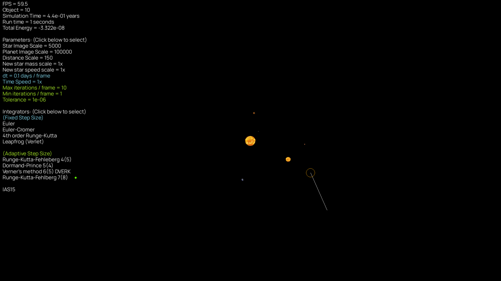

# Gravity Simulator
Newtonian N-body gravity simulator accelerated with C library
* Nine integrators including RKF7(8) and IAS15 are implemented
* WHFast and Barnes-Hut algorithm will be implemented in the future

This is a student project developed for learning purpose,
and is designed to be lightweight and easy to use. 
Other packages such as REBOUND are recommended for better 
accuracy and efficiency.


## Interactive simulator: 
Checkout the interactive simulator at https://www.github.com/alvinng4/OrbitSim



## Documentation
* [Quick Start](#quick-start)
    - [Python version](#python-version)
    - [Installation](#installation)
* [GravitySimulator API](#gravitysimulator-api)
* [Running the program](#running-the-program)
    - [C library / Numpy (Optional)](#c-library--numpy-optional-1)
* [Available systems](#available-systems-1)
* [Customizing system](#customizing-system)
* [Output animation in .gif](#output-animation-in-gif)
* [Saving the data](#saving-the-data)
* [Compensated summation](#compensated-summation)
* [Available integrators](#available-integrators)
    - [Fixed step size methods](#fixed-step-size-methods)
    - [Embedded Runge-Kutta methods](#embdedded-runge-kutta-methods)
    - [IAS15](#IAS15)
* [Feedback and Bugs](#feedback-and-bugs)
* [Data Sources](#data-sources)
* [References](#references)
* [Acknowledgement](#acknowledgement)

## Quick Start

### Python version
This program requires Python version 3.10 or higher. 

### Installation
Download the source files, or clone this repository by running the following command in terminal:
```
git clone https://github.com/alvinng4/Gravity-Simulator
```
Install the required packages by
```
pip install .
```

## GravitySimulator API

You may import the GravitySimulator API from `gravity_sim` to perform gravity simulation.
See `tutorial.ipynb` or `asteroid_belt_animation.py` for some example uses.
```
from gravity_sim immport GravitySimulator

grav_sim = GravitySimulator()

system = grav_sim.create_system()
system.load("solar_system")

grav_sim.launch_simulation(
    integrator="ias15",
    tf=grav_sim.years_to_days(1000.0),
    tolerance=1e-9,
    store_every_n=50,
)

grav_sim.save_results()
```

## Running the program in terminal

Once you have downloaded the source files, navigate to the source directory in terminal and run
```
python gravity_sim [-n|--numpy]
```

### C library / Numpy (Optional)
By default, the simulation is performed in C to improve performance.
If you want to use numpy, run the program with
```
python gravity_sim [-n|--numpy]
```

## Available systems
| System | Description |
|:-------|:------------| 
| circular_binary_orbit | A circular orbit formed by two stars |
| eccentric_binary_orbit | An eccentric orbit formed by two stars |
| 3d_helix | An upward helix consists of three stars |
| sun_earth_moon | The Sun, Earth, and Moon system |
| figure-8 | A "figure-8" orbit involving three stars  |
| pyth-3-body | Three stars arranged in a triangle with length ratios of 3, 4, and 5. It is a highly chaotic orbit with close encounters that can be used to test the difference between fixed and variable step size integrators. |
| solar_system | Solar System with the Sun and the planets |
| solar_system_plus | solar_system with the inclusion of Pluto, Ceres, and Vesta  |
| custom | Customize your own system |

## Customizing system
If you want to setup your own system, choose the "custom" option.
Note that the default unit is in solar masses, AU and days.

The system data will be saved once all the required information has been entered.
If you wish to make any changes, you can access the file at 
```
gravity_simulator/gravity_sim/customized_systems.csv
``` 
The data follow the format
```
Name, Gravitational constant, Number of objects, m1, ..., x1, y1, z1, ..., vx1, vy1, vz1, ...
```

## Output animation in .gif

You may output the trajectory in 2D / 3D as an animation in .gif.
The output file would be stored in `gravity_sim/result`.

To generate the animation, the program would ask for the following information:
* FPS: Frames per second
* Desired time length of the output file
* File name without extension
* Dots per inch (dpi): the resolution of the output file
* Dynamic axes limit: rescale the axes limit dynamically
* Maintain fixed dt: attempt to maintain fixed step size with variable time step data

## Saving the data
If you choose to save the data, the numerical data will be stored in the following folder:
```
Gravity-Simulator/gravity_sim/results
```
The file will starts with the metadata which starts with `#`.
Missing information will be saved as `None`.
More rows may be added in the future.

Below is an example:
```
# Data saved on (YYYY-MM-DD): 2024-07-27
# System Name: solar_system
# Integrator: IAS15
# Number of objects: 9
# Gravitational constant: 0.00029591220828411956
# Simulation time (days): 73048.4378
# dt (days): None
# Tolerance: 1e-09
# Data size: 64596
# Store every nth point: 1
# Run time (s): 1.4667500000214204
# masses: 1.0 1.6601208254589484e-07 2.447838287796944e-06 3.0034896154649684e-06 3.2271560829322774e-07 0.0009547919099414248 0.00028588567002459455 4.36624961322212e-05 5.151383772654274e-05
```
Then, the actual data will be saved in the default unit (solar masses, AU and days), and follow this format:
```
time, dt, total energy, x1, y1, z1, ... vx1, vy1, vz1, ...
```
The saved data file can be read by the program.
Even if the metadata is corrupted or missing, the program can still read the data file, although some information could be missing.

## Compensated summation

A method known as compensated summation [1], [4] is implemented for all integrators EXCEPT WHFast:

When we advance our system by $\text{d}t$, we have 

$x_{n+1} = x_n + \delta x$

Since $\delta x$ is very small compared to $x_n$, many digits of precision will be lost.
By compensated summation, we keep track of the losing digits using another variable, which
allows us to effectively eliminates round off error with very little cost.

However, for WHFast, the improvement is little but takes 10% longer run time.
Therefore, it is excluded from this method.

## Available integrators 
### Fixed step size methods
Fixed step size integrators are simple methods to simulate the system with the given step size dt.
| Fixed step size methods |
|:-----------|
| Euler |
| Euler Cromer |
| Fourth Order Runge-Kutta (RK4) |
| Leapfrog |

### Embedded Runge-Kutta methods
Embedded RK methods are adaptive methods that decides the step size automatically based on the estimated error. The system would adopt smaller step size for smaller tolerance.

| Embdedded Runge-Kutta methods | Recommended tolerance* |
|:-----------|:-------------|
| Runge–Kutta–Fehlberg 4(5) | 1e-8 to 1e-14 |
| Dormand–Prince method (DOPRI) 5(4) | 1e-8 to 1e-14 |
| Verner's method (DVERK) 6(5) | 1e-8 to 1e-14 |
| Runge–Kutta–Fehlberg 7(8) | 1e-4 to 1e-8 |

### IAS15
IAS15 (Implicit integrator with Adaptive time Stepping, 15th order) is a highly optimized and efficient integrator. It is the default method for this project.

Recommended tolerance*: 1e-9

*For reference only

### WHFast
WHFast is a fast symplectic method with fixed step size. Similar to LeapFrog, it conserves energy over long integration period.

> [!WARNING]\
> When using WHFast, the order of adding objects matters. Since WHFast use Jacobi coordinate, we must first add the inner object. For convenience, you may also add the objects first, then call `system.sort_by_distance(primary_object_name)` or `system.sort_by_distance(primary_object_index)`

## Feedback and Bugs
If you find any bugs or want to leave some feedback, please feel free to let me know by opening an issue or sending an email to alvinng324@gmail.com.

## Data Sources
The solar system positions and velocities data at 1/Jan/2024 are collected from the Horizons System [2].
Gravitational constant, and masses of the solar system objects are calculated using the
data from R.S. Park *et. al*. [3].

## References
1. E. Hairer, C. Lubich, and G. Wanner, "Reducing Rounding Errors" in *Geometric Numerical Integration: Structure-Preserving Algorithms for Ordinary Differential Equations*. Springer, 2004, pp. 272-274.
2. Horizons System, Jet Propulsion Laboratory, https://ssd.jpl.nasa.gov/horizons/
3. R. S. Park, et al., 2021, “The JPL Planetary and Lunar Ephemerides DE440 and DE441”, https://ssd.jpl.nasa.gov/doc/Park.2021.AJ.DE440.pdf, Astronomical Journal, 161:105.
4. H. Rein, and D. S. Spiegel, 2014, "IAS15: A fast, adaptive, high-order integrator for gravitational dynamics,
accurate to machine precision over a billion orbits", Monthly Notices of the Royal Astronomical Society 446:
1424–1437.

## Acknowledgement
The integrators in this project were developed with great assistance from the following book: 
* J. Roa, et al. *Moving Planets Around: An Introduction to N-Body Simulations Applied to Exoplanetary Systems*, MIT Press, 2020