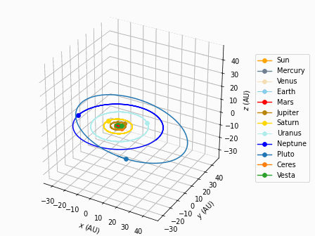
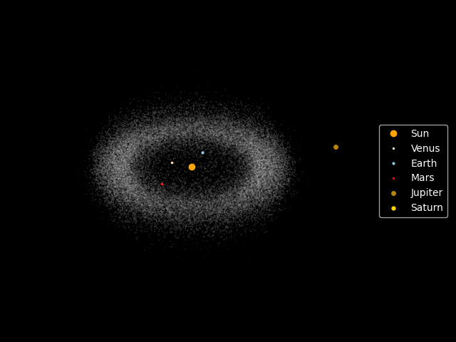

# grav_sim

N-body gravity simulation library with C and Python API

**Target Audience:**

* Physics students
* Anyone interested in N-body simulations.

**Features:**

* Ten integrators including WHFast and IAS15
* Barnes-Hut algorithm with linear octree
* Particle-Mesh method for cosmological structure formation
* Multiple sample projects

## Sample projects

Some projects are done with the API. The scripts are stored at the `examples` folder.

#### Evolving the solar system for 1 million years

#### Asteroid belt simulation

#### Formation of Kirkwood gaps

Videos:
* https://www.youtube.com/watch?v=AEyjIF-8zT0
* https://www.youtube.com/watch?v=jHLLr7ACvDQ

#### Galaxy collision
Note: Initial condition is taken from Gadget-2 by Volker Springel.
Visualization is done with gadgetviewer.

## Feedback and Bugs
If you found any bugs or want to leave some feedback, please feel free to let me know by opening an issue or sending an email to alvinng324@gmail.com.
