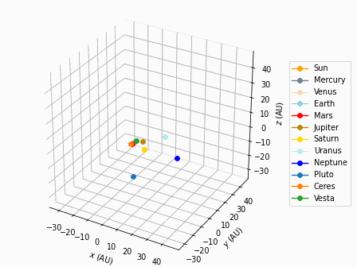
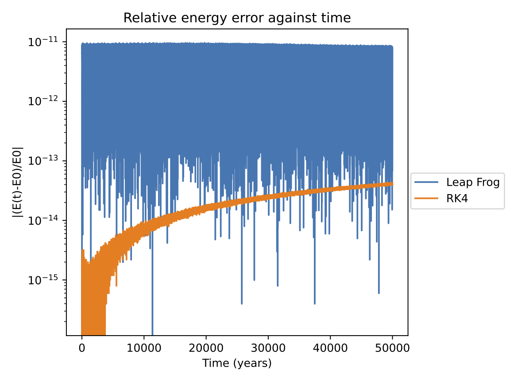
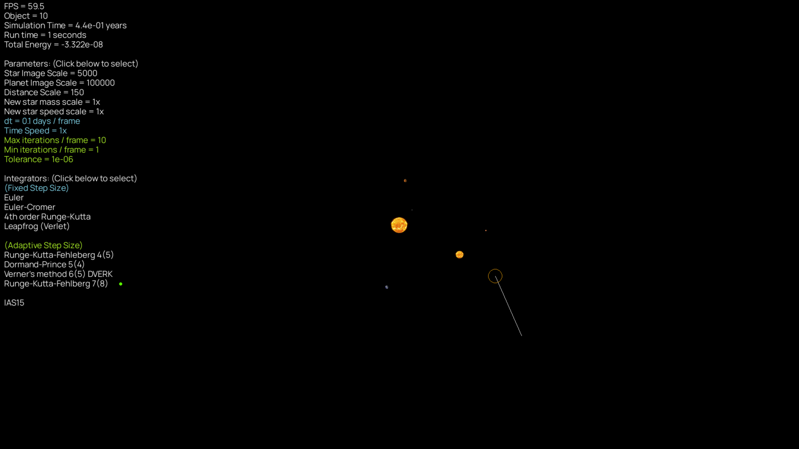
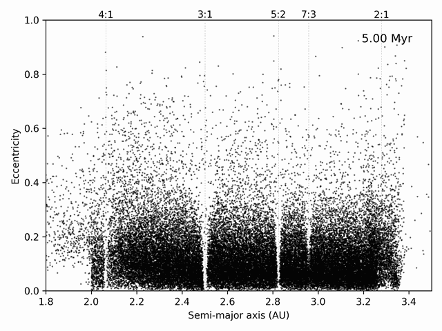
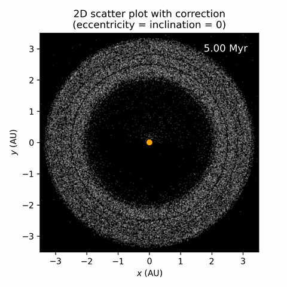

# Gravity Simulator
Newtonian N-body gravity simulator accelerated with C library

* Ten integrators including WHFast and IAS15 
* Barnes-Hut algorithm (prototype)
* CUDA acceleration will be implemented in the future

This is a student project developed for learning purpose.
It aims to be lightweight and easy to use. 
Other packages such as REBOUND are recommended for better 
accuracy and efficiency.





## Interactive simulator: 
Checkout the interactive simulator at https://www.github.com/alvinng4/OrbitSim



## Documentation
* [Quick Start](#quick-start)
    - [Python version](#python-version)
    - [Installation](#installation)
    - [Important note](#important-note)
* [GravitySimulator API](#gravitysimulator-api)
* [Running the program](#running-the-program)
* [Default systems](#default-systems)
* [Integrators](#integrators)
    - [Simple methods](#simple-methods)
    - [Embedded Runge-Kutta methods](#embdedded-runge-kutta-methods)
    - [IAS15](#IAS15)
    - [WHFast](#whfast)
* [Make changes to saved systems](#make-changes-to-saved-systems)
* [Saving the results](#saving-the-results)
* [Output animations in .gif](#output-animations-in-gif)
* [Compensated summation](#compensated-summation)
* [Feedback and Bugs](#feedback-and-bugs)
* [Data Sources](#data-sources)
* [References](#references)
* [Acknowledgement](#acknowledgement)

## Quick Start

### Python version
This program requires Python version 3.10 or higher. 

### Installation
Download the source files, or clone this repository by running the following command in terminal:
```
git clone https://github.com/alvinng4/Gravity-Simulator
```
Install the required packages by
```
pip install .
```
If the installation is not successful, install the following packages manually:
```
matplotlib==3.8.3
numpy==1.26.4
rich==13.7.1
```

## Important note
* This project offers two user-interface: API and CLI. 
CLI is good for starters, 
but API is generally recommended as it is 
more flexible and provides more options.
* The default unit for this project is solar masses, AU and days, with G = 0.00029591220828411956.
It is possible to change this value in the API by changing `system.G`.
* Animations, simulation results, etc. will be stored to `gravity_sim/result` by default, unless a file path is specified.
* Complex animations like the asteroid belt cannot be done solely with the API functions. Sample scripts are provided in this repository (See [Sample projects](#sample-projects))

## GravitySimulator API

You may import the GravitySimulator API from `gravity_sim` to perform gravity simulation.
See `tutorial.ipynb` or [Sample projects](#sample-projects) for some example usage.
```
from gravity_sim immport GravitySimulator

grav_sim = GravitySimulator()
gravity_sim.integration_mode = "c_lib"  # "numpy" is also available

system = grav_sim.create_system()
system.load("solar_system")

grav_sim.launch_simulation(
    integrator="ias15",
    tf=grav_sim.years_to_days(1000.0),
    tolerance=1e-9,
    store_every_n=50,
)

grav_sim.plot_2d_trajectory()
grav_sim.save_results()
```

#### launch_simulation
launch_simulation() is the main method for initiating the simulation.
Certainly! Here's a table documenting the parameters for the `launch_simulation` function:

| Parameter | Type | Default | Description |
|-----------|------|---------|-------------|
| `integrator` | str | Required | Name of the integrator |
| `tf` | float | Required | Simulation time (days) |
| `dt` | float | None | Time step (days) |
| `tolerance` | float | None | Tolerance for adaptive step integrators |
| `store_every_n` | int | 1 | Store results every n steps |
| `acceleration_method` | str | `pairwise` | Method for calculating accelerations |
| `storing_method` | str | `default` | Method for storing simulation results |
| `flush_results_path` | str | None | Path to flush intermediate results. |
| `no_progress_bar` | bool | False | If True, disables the progress bar. |
| `no_print` | bool | False | If True, disables some printing to console |
| `**kwargs` | dict | - | Additional keyword arguments. |

#### integrators 
`euler`, `euler_cromer`, `rk4`, `leapfrog`, `rkf45`, `dopri`, `dverk`, `rkf78`, `ias15`, `whfast`

#### acceleration_method
- `pairwise`
    * Brute force pairwise calculations for gravitational acceleration
    * Time complexity: $O(N^2)$
- `massless`
    * Similar to `pairwise`, but seperate the calculations for massive and massless particles
    * Time complexity: $O(M^2 + MN)$, where $M$ and $N$ are the number of massive and massless particles respectively
- `barnes-hut`
    * Calculate gravitational acceleration with barnes-hut algorithm
    * Time complexity: $O(N \log{N})$
    * `**kwargs`: `barnes_hut_theta`
        * Threshold for Barnes-hut algorithm, default = 0.5

#### storing_method
- `default`
    * Store solutions directly into memory
- `flush`
    * Flush intermediate results into a csv file in `gravity_sim/results` to reduce memory pressure.
- `no_store`
    * Do not store any result, typically used for benchmarking.

## Sample projects

Some projects are done with the API. The scripts are stored at the `examples` folder.

#### Asteroid belt animation


#### Formation of Kirkwood gap




Videos: 
* https://www.youtube.com/watch?v=AEyjIF-8zT0
* https://www.youtube.com/watch?v=jHLLr7ACvDQ

## Running the program in terminal

Once you have downloaded the source files, navigate to the source directory in terminal and run
```
python gravity_sim [-n|--numpy]
```
`-n, --numpy`: run the program with NumPy instead of C library

## Default systems
Some systems are available by default.
| System | Description |
|:-------|:------------| 
| circular_binary_orbit | A circular orbit formed by two stars |
| eccentric_binary_orbit | An eccentric orbit formed by two stars |
| 3d_helix | An upward helix consists of three stars |
| sun_earth_moon | The Sun, Earth, and Moon system |
| figure-8 | A "figure-8" orbit involving three stars  |
| pyth-3-body | Three stars arranged in a triangle with length ratios of 3, 4, and 5. It is a highly chaotic orbit with close encounters that can be used to test the difference between fixed and variable step size integrators. |
| solar_system | Solar System with the Sun and the planets |
| solar_system_plus | solar_system with the inclusion of Pluto, Ceres, and Vesta  |

## Integrators 
### Simple methods
Below are four simple fixed step size methods to simulate the system with a given step size $\text{d}t$.
| Simple methods |
|:-----------|
| Euler |
| Euler Cromer |
| Fourth Order Runge-Kutta (RK4) |
| Leapfrog |

### Embedded Runge-Kutta methods
Embedded RK methods are adaptive methods that decides the step size automatically based on the estimated error.
It can resolve close encounters but fail to conserve energy over long time scele.

| Embdedded Runge-Kutta methods | Recommended tolerance* |
|:-----------|:-------------|
| Runge–Kutta–Fehlberg 4(5) | $10^{-8}$ to $10^{-14}$ |
| Dormand–Prince method (DOPRI) 5(4) | $10^{-8}$ to $10^{-14}$ |
| Verner's method (DVERK) 6(5) | $10^{-8}$ to $10^{-14}$ |
| Runge–Kutta–Fehlberg 7(8) | $10^{-4}$ to $10^{-8}$ |

*For reference only

### IAS15
IAS15 (Implicit integrator with Adaptive time Stepping, 15th order) is a highly optimized integrator with extremely high accuracy. It is the default method for this project.

The recommended tolerance* is $10^{-9}$. Since the integrator is 15th order, changing the tolerance
results in little improvement in performance, but a huge penalty in accuracy. Therefore, it is not
recommended to change this tolerance.

*For reference only

### WHFast
WHFast is a second order symplectic method with fixed step size, which conserves energy over long integration period. This integrator cannot resolve close encounter.

#### `**kwargs` for WHFast
| Argument               | Description                                                  | Default Value |
|------------------------|--------------------------------------------------------------|---------------|
| `kepler_tol`           | Tolerance in solving the Kepler's equation                   | $10^{-12}$    |
| `kepler_max_iter`      | Maximum number of iterations in solving Kepler's equation    | 500        |
| `kepler_auto_remove`   | Integer flag to indicate whether to remove objects that failed to converge in Kepler's equation | False |
| `kepler_auto_remove_tol` | Tolerance for removing objects that failed to converge in Kepler's equation  | $10^{-8}$ |

> [!WARNING]\
> When using WHFast, the order of adding objects matters. Since WHFast use Jacobi coordinate, we must add the inner object first, followed by outer objects relative to the central star. For convenience, you may also add the objects in any order, then call `system.sort_by_distance(primary_object_name)` or `system.sort_by_distance(primary_object_index)`

## Making changes to saved systems

If you wish to make any changes to saved systems, you can access the file at 
```
gravity_simulator/gravity_sim/customized_systems.csv
``` 
The data follow the format
```
Name, Gravitational constant, Number of objects, m1, ..., x1, y1, z1, ..., vx1, vy1, vz1, ...
```
You may also load the system in API and then save the system after making the changes.

## Saving the results
If you saved the results, the numerical data will be stored in the following folder:
```
Gravity-Simulator/gravity_sim/results
```
The file will starts with the metadata which starts with `#`.
Missing information will be saved as `None`.
More rows may be added in the future.

Below is an example:
```
# Data saved on (YYYY-MM-DD): 2024-07-27
# System Name: solar_system
# Integrator: IAS15
# Number of objects: 9
# Gravitational constant: 0.00029591220828411956
# Simulation time (days): 73048.4378
# dt (days): None
# Tolerance: 1e-09
# Data size: 64596
# Store every nth point: 1
# Run time (s): 1.4667500000214204
# masses: 1.0 1.6601208254589484e-07 2.447838287796944e-06 3.0034896154649684e-06 3.2271560829322774e-07 0.0009547919099414248 0.00028588567002459455 4.36624961322212e-05 5.151383772654274e-05
```
Then, the actual data will be saved in the default unit (solar masses, AU and days), and follow this format:
```
time, dt, total energy, x1, y1, z1, ... vx1, vy1, vz1, ...
```
The saved data file can be read by the program.
Even if the metadata is corrupted or missing, the program can still read the data file, although some information could be missing.

## Output animations in .gif

You may output the simple trajectory animations in 2D / 3D in .gif.
The output file would be stored in `gravity_sim/result`.

Available parameters:
| Parameter                  | Description                                             |
|----------------------------|---------------------------------------------------------|
| FPS                        | Frames per second                                       |
| Animation length           | Desired length of the output gif                        |
| plot_every_nth_point       | File name without extension                             |
| dpi                        | The resolution of the animation (dots per inch)         |
| is_dynamic_axes            | Rescale the axes limit dynamically                      |
| axes_lim | An array for the axes limits
| is_maintain_fixed_dt          | Attempt to maintain fixed step size with variable time step data |
| traj_len | Length of the trajectory in number of data points |

Some parameters are not listed here due to limit of space.

## Compensated summation

A method known as compensated summation [1], [4] is implemented for all integrators EXCEPT WHFast:

When we advance our system by $\text{d}t$, we have 

$x_{n+1} = x_n + \delta x$

Since $\delta x$ is very small compared to $x_n$, many digits of precision will be lost.
By compensated summation, we keep track of the losing digits using another variable, which
allows us to effectively eliminates round off error with very little cost.

However, for WHFast, the improvement is little but takes 10% longer run time.
Therefore, it is excluded from this method.

## Feedback and Bugs
If you find any bugs or want to leave some feedback, please feel free to let me know by opening an issue or sending an email to alvinng324@gmail.com.

## Data Sources
The solar system positions and velocities data at 1/Jan/2024 are collected from the Horizons System [2].
Gravitational constant, and masses of the solar system objects are calculated using the
data from R.S. Park *et. al*. [3].

## References
1. E. Hairer, C. Lubich, and G. Wanner, "Reducing Rounding Errors" in *Geometric Numerical Integration: Structure-Preserving Algorithms for Ordinary Differential Equations*. Springer, 2004, pp. 272-274.
2. Horizons System, Jet Propulsion Laboratory, https://ssd.jpl.nasa.gov/horizons/
3. R. S. Park, et al., 2021, “The JPL Planetary and Lunar Ephemerides DE440 and DE441”, https://ssd.jpl.nasa.gov/doc/Park.2021.AJ.DE440.pdf, Astronomical Journal, 161:105.
4. H. Rein, and D. S. Spiegel, 2014, "IAS15: A fast, adaptive, high-order integrator for gravitational dynamics,
accurate to machine precision over a billion orbits", Monthly Notices of the Royal Astronomical Society 446:
1424–1437.

## Acknowledgement
The integrators in this project were developed with great assistance from the following book: 
* J. Roa, et al. *Moving Planets Around: An Introduction to N-Body Simulations Applied to Exoplanetary Systems*, MIT Press, 2020