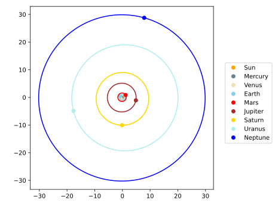
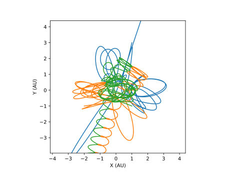
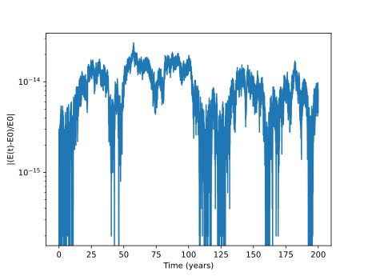
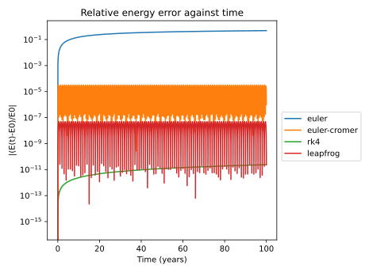

# Gravity Simulator
This is a Newtonian 3D N-body gravity simulator program which projects the results on the xy plane.
* With the plotting module, you may set up your own system and generate a plot easily.
* The interactive module enables real-time interaction with the gravity simulator.



## Documentation
* [Quick Start](#quick-start)
    - [Python version](#python-version)
    - [Installation](#installation)
* [Plotting module](#plotting-module)
    - [Running the program](#running-the-program)
    - [Available systems](#available-systems)
    - [Customizing system](#customizing-system)
    - [Saving the data](#saving-the-data)
    - [C library / Numpy](#c-library--numpy)
    - [Comparing relative energy error of multiple simulations (Additional)](#comparing-relative-energy-error-of-multiple-simulations-additional)
    - [Program crashes](#program-crashes)
* [Interactive module](#interactive-module)
    - [Running the program](#running-the-program)
    - [Available systems](#available-systems-1)
    - [Control](#control)
    - [Changing the resolution](#changing-the-resolution)
* [Available integrators](#available-integrators)
    - [Fixed step size integrators](#fixed-step-size-integrators)
    - [Adaptive step size integrators](#adaptive-step-size-integrators)
* [Feedback and Bugs](#feedback-and-bugs)
* [Data references](#data-references)
* [Bibliography](#bibliography)

## Quick Start

### Python version
This program requires Python version 3.10 or higher. 

### Installation
Download the source file, or clone this repository by running the following command in terminal:
```
git clone https://github.com/alvinng4/Gravity-Simulator
```
Install the required packages by
```
pip install -r requirements.txt
```
## Plotting module




### Running the program

Once you have downloaded the source files, navigate to the directory of the source files in terminal and run
```
python gravity_plot
```

### Available systems
| System | Description |
|:-------|:------------| 
| circular_binary_orbit | A circular orbit formed by two stars |
| eccentric_binary_orbit | An eccentric orbit formed by two stars |
| 3d_helix | An upward helix consists of three stars |
| sun_earth_moon | The Sun, Earth, and Moon system |
| figure-8 | A "figure-8" orbit involving three stars  |
| pyth-3-body | Three stars arranged in a triangle with length ratios of 3, 4, and 5 |
| solar_system | A simple version of the solar system |
| solar_system_plus | solar_system but with the inclusion of Pluto, Ceres, and Vesta  |
| custom | Customize your own system |

### Customizing system
If you want to setup your own system, choose the "custom" option.
Note that the default unit is in solar masses, AU and days.

The system data will be saved once all the required information has been entered.
If you wish to make any changes, you can access the file at 
```
gravity_simulator/gravity_plot/customized_systems.csv
``` 
The data follow the format
```
Name, Number of objects, [m1, m2], [x1, y1, z1, ..., vx1, vy1, vz1, ...]
```
### Saving the data
After each simulation, the program would ask if you want to save the data.
If you chose to do so, the numerical data will be stored in the following folder:
```
gravity_simulator/gravity_plot/results
```
The data except time will be in the default unit (solar masses, AU and days), and follow this format:
```
time(days/years), total energy, x1, y1, z1, ... vx1, vy1, vz1, ...
```
Total energy will be stored as `0.0` if user chose not to compute energy.

### C library / Numpy
By default, the module utilize the code written in C to improve performance.
Nevertheless, the code in C and numpy are almost identical and gives similar result.
If you want to use numpy, run the program with
```
python gravity_plot -n
```

### Comparing relative energy error of multiple simulations (Additional)
To compare the relative energy error of multiple simulations, 
You can run `compare.py` inside the `gravity_plot` folder.
The chosen data inside the `gravity_plot/results` folder would be read to generate a plot. 
This module is not included in the main program.

If you want to customize the title of the graph, run the program with the following argument:
```
python compare.py -t <title>
```



### Program crashes
If your program won't start and shows error messages related to ctypes library or dll files after running
```
python gravity_plot
```
you may fix this issue by running with numpy (See [C library / Numpy](#c-library--numpy))
or try running the program with 64-bit python.

You are also welcomed to contact me if you see any error. (See [Feedback and Bugs](#feedback-and-bugs))

## Interactive module
### Running the program
Once you have downloaded the source files, navigate to the directory of the source files in terminal and run
```
python gravity_sim
```
### Available systems
| System | Description |
|:-------|:------------| 
| Void | Emptiness |
| figure-8 | A "figure-8" orbit involving three stars  |
| pyth-3-body* | Three stars arranged in a triangle with length ratios of 3, 4, and 5 |
| solar_system | A simple version of the solar system |

*Use adaptive step size integrators for pyth-3-body. Fixed step size integrators do not have enough accuracy. See [Adaptive step size integrators](#adaptive-step-size-integrators).

### Control
Move camera: `W` `A` `S` `D`\
Menu: `Esc`\
Pause: `P`\
Toggle full-screen mode: `F`\
Hide user interface: `H`\
Reset parameters: `R`\
Create new star: 
Hold the right mouse button to create a star + drag the mouse to give it an initial boost.\
Adjust parameter values: Left-click on the parameters panel to select a parameter + scroll to change its value.\
Switch integrators: Left-click the integrator on the integrators panel.

Warning: switching integrators in the middle of simulation may produce numerical error.
### Changing the resolution
The default resolution is set to the user's screen size. However, you can set your own resolution by the following command:
```
python3 gravity_sim -r <width> <height>
```

## Available integrators 
### Fixed step size integrators
Fixed step size integrators are simple methods to simulate the system with the given step size dt.
| Fixed step size integrators |
|:-----------|
| Euler |
| Euler_cromer |
| Fourth Order Runge-Kutta |
| Leapfrog |

### Adaptive step size integrators
Adaptive step size integrators are efficient and accurate methods that decides the step size automatically based on the estimated error. The system would adopt smaller step size for smaller tolerance.

| Adaptive step size integrators | Recommended tolerance** |
|:-----------|:-------------|
| Runge–Kutta–Fehlberg 4(5) | 1e-8 to 1e-14 |
| Dormand–Prince method (DOPRI) 5(4) | 1e-8 to 1e-14 |
| Verner's method (DVERK) 6(5) | 1e-8 to 1e-14 |
| Runge–Kutta–Fehlberg 7(8) | 1e-4 to 1e-8 |

**For reference only

## Feedback and Bugs
If you find any bugs or want to give me your feedback, please feel free to let me know by sending an email to alvinng324@gmail.com or open an issue.

## Data References
1. Park, R.S., et al., 2021, “The JPL Planetary and Lunar Ephemerides DE440 and DE441”, https://ssd.jpl.nasa.gov/doc/Park.2021.AJ.DE440.pdf, *Astronomical Journal*, 161:105.
2. Horizons System, Jet Propulsion Laboratory, https://ssd.jpl.nasa.gov/horizons/

## Bibliography
1. Roa, Javier, et al. *Moving Planets Around: An Introduction to N-Body Simulations Applied to Exoplanetary Systems*, MIT Press, 2020
