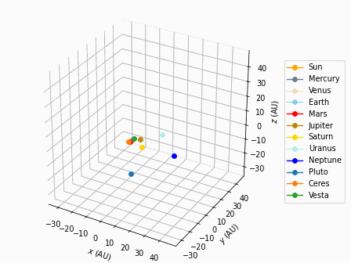
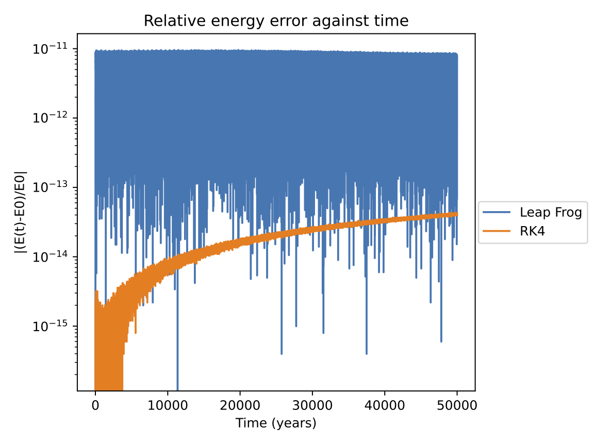

# Gravity Simulator
This is a Newtonian N-body gravity simulator.

* Interactive module: real time interactive N-body simulation
* Plotting module: customize your own system and generating plots




## Online demo for interactive module: 
Link: https://alvinng4.github.io/Gravity_Simulator_Web/

Click *once* after you see the green loading bar showing
"Ready to start!". You should then see the main
menu. From there, simply select a system to start. 
See [controls](#controls) for basic controls.

This online demo is built with the pygbag package. 

> [!Warning]\
> In Safari, if you accidently selected/clicked the window,
> the FPS would drops significantly. To fix it, simply click
> on something else outside the game window.


## Documentation
* [Quick Start](#quick-start)
    - [Python version](#python-version)
    - [Installation](#installation)
    - [Running the program](#running-the-program)
    - [Check if the C libraries are loaded properly (Optional)](#check-if-the-c-libraries-are-loaded-properly-optional)
* [Program keeps crashing. What should I do?](#program-keeps-crashing-what-should-i-do)
* [Interactive module](#interactive-module)
    - [Running the program](#running-the-program-1)
    - [C library / Numpy (Optional)](#c-library--numpy-optional)
    - [Changing the resolution (Optional)](#changing-the-resolution-optional)
    - [Available systems](#available-systems)
    - [Controls](#controls)
* [Plotting module](#plotting-module)
    - [Running the program](#running-the-program-2)
    - [C library / Numpy (Optional)](#c-library--numpy-optional-1)
    - [Store every nth point (Optional)](#store-every-nth-point-optional)
    - [Available systems](#available-systems-1)
    - [Customizing system](#customizing-system)
    - [Output animation in .gif](#output-animation-in-gif)
    - [Saving the data](#saving-the-data)
* [Compensated summation](#compensated-summation)
* [Available integrators](#available-integrators)
    - [Fixed step size methods](#fixed-step-size-methods)
    - [Embedded Runge-Kutta methods](#embdedded-runge-kutta-methods)
    - [IAS15](#IAS15)
* [Data Sources](#data-sources)
* [Feedback and Bugs](#feedback-and-bugs)
* [References](#references)
* [Acknowledgement](#acknowledgement)

## Quick Start

### Python version
This program requires Python version 3.10 or higher. 

### Installation
Download the source files, or clone this repository by running the following command in terminal:
```
git clone https://github.com/alvinng4/Gravity-Simulator
```
Install the required packages by
```
pip install .
```
### Running the program
Interactive module: run the following command in terminal
```
python gravity_sim
```
Plotting module: run the following command in terminal
```
python gravity_plot
```

### Check if the C libraries are loaded properly (Optional)
If the C libraries cannot be loaded after running the program, you should see the following message in your terminal window
```
System message: Loading c_lib failed. Running with numpy.
```
This does not affect the simulation result, but running with numpy could cause the program to be 500 to 1400 times slower.
To fix this, you may need to recompile the library from the `src` folder.

## Program keeps crashing. What should I do?

First, make sure that you are running with python version >= 3.10 and have installed all the required packages. If yes, try running the program with numpy and see if the problem gets fixed. 
To run with numpy, execute the following command in terminal:
```
python gravity_sim --numpy
```
```
python gravity_plot --numpy
```
However, note that the program could run about 500 to 1400 times slower with numpy.
If the problem persists, please feel free to let me know by opening an issue.

## Interactive module
### Running the program
Once you have downloaded the source files, navigate to the directory of the source files in terminal and run
```
python gravity_sim [-n|--numpy] [-r|--resolution <width> <height>]
```

### C library / Numpy (Optional)
By default, the module utilize C to improve performance.
Numpy is about 500 to 1000 times slower.
Nevertheless, the calculation in C and numpy are almost identical and gives similar result.
If you want to use numpy, run the program with
```
python gravity_sim [-n|--numpy]
```

### Changing the resolution (Optional)
The default resolution is set to the user's screen size. However, you can set your own resolution by the following command:
```
python3 gravity_sim [-r|--resolution <width> <height>]
```

### Available systems
| System | Description |
|:-------|:------------| 
| Void | Emptiness |
| figure-8 | A "figure-8" orbit involving three stars  |
| pyth-3-body | Three stars arranged in a triangle with length ratios of 3, 4, and 5 |
| solar_system | Solar System with the Sun and the planets |

> [!TIP]\
> Pythagorean three body orbit is a highly chaotic orbit with close encounters, which is useful to test the difference
between fixed and variable step size integrators.
For RK4, the largest dt to produce desired result is 2e-8 days.

### Controls

| Action | Control |
|:-------|:------------| 
| Move camera | `W` `A` `S` `D`/ `↑` `↓` `←` `→`|
| Menu | `Esc`|
| Pause | `P` |
| Toggle full-screen mode | `F` |
| Hide user interface | `H` |
| Reset parameters | `R` |
| Create new star | Hold the right mouse button to create a star + drag the mouse to give it an initial boost. |
| Adjust parameter values| Left-click the parameter on the parameters panel + scroll to change its value. |
| Switch integrators | Left-click the integrator on the integrators panel. |


> [!WARNING]\
> Switching integrators or changing dt in the middle of simulation may produce some numerical error.

## Plotting module




### Running the program

Once you have downloaded the source files, navigate to the directory of the source files in terminal and run
```
python gravity_plot [-n|--numpy] [-s|--store_every_n=<int>]
```

### C library / Numpy (Optional)
By default, the module utilize the code written in C to improve performance.
Numpy is about 500 to 1000 times slower and produces slightly more error.
Nevertheless, the calculation in C and numpy are almost identical and gives similar result.
If you want to use numpy, run the program with
```
python gravity_plot [-n|--numpy]
```

### Store every nth point (Optional)
With long integration time and short dt, there would be a lot of unnecessary solutions stored in the memory, 
which causes the program to slow down significantly and may even terminates itself. 
In general, a data size of 50000 - 100000 points should be enough for most purposes.
To fix this, run the following command to store every nth point
```
python gravity_plot [-s|--store_every_n=<int>]
```
You may also trim the data after the simulation is finished.

### Available systems
| System | Description |
|:-------|:------------| 
| circular_binary_orbit | A circular orbit formed by two stars |
| eccentric_binary_orbit | An eccentric orbit formed by two stars |
| 3d_helix | An upward helix consists of three stars |
| sun_earth_moon | The Sun, Earth, and Moon system |
| figure-8 | A "figure-8" orbit involving three stars  |
| pyth-3-body* | Three stars arranged in a triangle with length ratios of 3, 4, and 5 |
| solar_system | Solar System with the Sun and the planets |
| solar_system_plus | solar_system with the inclusion of Pluto, Ceres, and Vesta  |
| custom | Customize your own system |

> [!TIP]\
> Pythagorean three body orbit is a highly chaotic orbit with close encounters, which is useful to test the difference
between fixed and variable step size integrators.
For RK4, the largest dt to produce desired result is 2e-8 days.

### Customizing system
If you want to setup your own system, choose the "custom" option.
Note that the default unit is in solar masses, AU and days.

The system data will be saved once all the required information has been entered.
If you wish to make any changes, you can access the file at 
```
gravity_simulator/gravity_plot/customized_systems.csv
``` 
The data follow the format
```
Name, Number of objects, m1, ..., x1, y1, z1, ..., vx1, vy1, vz1, ...
```
Note: If you have customized system data with the older version, there are "[" and "]" inside the data, which would not work anymore.
Please remove them manually.

### Output animation in .gif

You may output the trajectory in 2D / 3D as an animation in .gif.
The output file would be stored in `gravity_plot/result`.

To generate the animation, the program would ask for the following information:
* FPS: Frames per second
* Desired time length of the output file
* File name without extension
* Dots per inch (dpi): the resolution of the output file
* Dynamic axes limit: rescale the axes limit dynamically
* Maintain fixed dt: useful if you are using variable time step integrators

### Saving the data
If you choose to save the data, the numerical data will be stored in the following folder:
```
gravity-simulator/gravity_plot/results
```
The data will be in the default unit (solar masses, AU and days), and follow this format:
```
time, dt, total energy, x1, y1, z1, ... vx1, vy1, vz1, ...
```

## Compensated summation

A method known as compensated summation [1], [4] is implemented in the plotting module.

When we advance our system by $\text{d}t$, we have 

$x_{n+1} = x_n + \delta x$

Since $\delta x$ is very small compared to $x_n$, many digits of precision will be lost.
By compensated summation, we keep track of the losing digits using another variable, which
allows us to effectively eliminates round off error with very little cost.

## Available integrators 
### Fixed step size methods
Fixed step size integrators are simple methods to simulate the system with the given step size dt.
| Fixed step size methods |
|:-----------|
| Euler |
| Euler Cromer |
| Fourth Order Runge-Kutta (RK4) |
| Leapfrog |

### Embedded Runge-Kutta methods
Embedded RK methods are adaptive methods that decides the step size automatically based on the estimated error. The system would adopt smaller step size for smaller tolerance.

| Embdedded Runge-Kutta methods | Recommended tolerance* |
|:-----------|:-------------|
| Runge–Kutta–Fehlberg 4(5) | 1e-8 to 1e-14 |
| Dormand–Prince method (DOPRI) 5(4) | 1e-8 to 1e-14 |
| Verner's method (DVERK) 6(5) | 1e-8 to 1e-14 |
| Runge–Kutta–Fehlberg 7(8) | 1e-4 to 1e-8 |

### IAS15
IAS15 (Implicit integrator with Adaptive time Stepping, 15th order) is a highly optimized and efficient integrator. It is the default method of the plotting module.

Recommended tolerance*: 1e-9

*For reference only

## Data Sources
The solar system positions and velocities data at 1/Jan/2024 are collected from the Horizons System [2].
Gravitational constant, and masses of the solar system objects are calculated using the
data from R.S. Park *et. al*. [3].

## Feedback and Bugs
This is my first programming project after learning programming for 7 months, so there could be a lot of bugs.
If you find any bugs or want to give me your feedback, please feel free to let me know by sending an email to alvinng324@gmail.com or open an issue.

## References
1. E. Hairer, C. Lubich, and G. Wanner, "Reducing Rounding Errors" in *Geometric Numerical Integration: Structure-Preserving Algorithms for Ordinary Differential Equations*. Springer, 2004, pp. 272-274.
2. Horizons System, Jet Propulsion Laboratory, https://ssd.jpl.nasa.gov/horizons/
3. R. S. Park, et al., 2021, “The JPL Planetary and Lunar Ephemerides DE440 and DE441”, https://ssd.jpl.nasa.gov/doc/Park.2021.AJ.DE440.pdf, Astronomical Journal, 161:105.
4. H. Rein, and D. S. Spiegel, 2014, "IAS15: A fast, adaptive, high-order integrator for gravitational dynamics,
accurate to machine precision over a billion orbits", Monthly Notices of the Royal Astronomical Society 446:
1424–1437.

## Acknowledgement
The integrators in this project were developed with great assistance from the following book: 
* J. Roa, et al. *Moving Planets Around: An Introduction to N-Body Simulations Applied to Exoplanetary Systems*, MIT Press, 2020