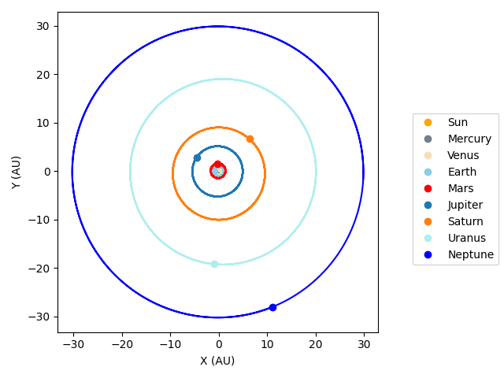

# N-body-gravity-simulator
Welcome to my Python project: N-body gravity simulator. This project is currently under development.



## Progress
* Fixed step-size and variable step-size methods for N-body are implemented.
* 4 modes are available: Void, Solar System, Figure-8 Orbit and Pythagorean Three-Body Orbit.

## Quick Start
### Python version
This program requires Python version 3.11. 

### Installation
Download the source file, or clone this repository by running the following command in terminal:
```
git clone https://github.com/alvinng4/N-body-gravity-simulator
```
Install the required packages by
```
pip install -r requirements.txt
```

### Running the program
Once you have downloaded the source files, navigate to the directory of the source files in terminal and run the following commands.

Plotting module:
```
python plotting
```
Interactive simulator module:
```
python gravity_sim
```
## Control
Move camera: `W` `A` `S` `D`\
Menu: `Esc`\
Pause: `P`\
Toggle full-screen mode: `F`\
Hide user interface: `H`\
Reset parameters: `R`\
Create new star: 
Hold the right mouse button to create a star + drag the mouse to give it an initial boost.\
Adjust parameter values: Left-click on the parameters panel to select a parameter + scroll to change its value.\
Switch integrators: Left-click the integrator on the integrators panel.

Warning: switching integrators in the middle of simulation may produce numerical error.
## Changing the resolution
The default resolution is set to the user's screen size. However, you can set your own resolution by the following command:
```
python3 gravity_sim -r <width> <height>
```
## Data References
1. Park, R.S., et al., 2021, “The JPL Planetary and Lunar Ephemerides DE440 and DE441”, https://ssd.jpl.nasa.gov/doc/Park.2021.AJ.DE440.pdf, *Astronomical Journal*, 161:105.
2. Horizons System, Jet Propulsion Laboratory, https://ssd.jpl.nasa.gov/horizons/

## Bibliography
1. Roa, Javier, et al. *Moving Planets Around: An Introduction to N-Body Simulations Applied to Exoplanetary Systems*, MIT Press, 2020
