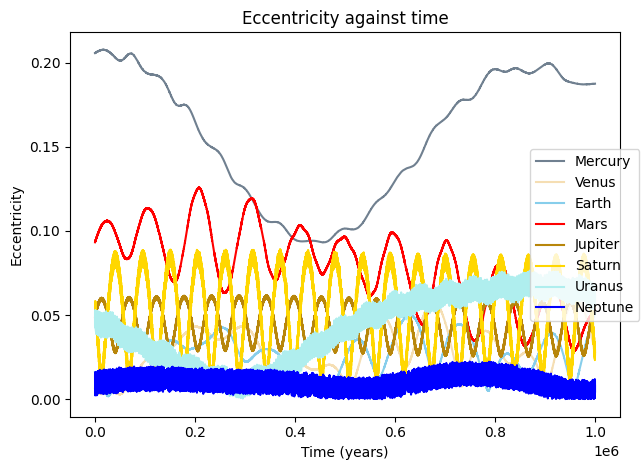
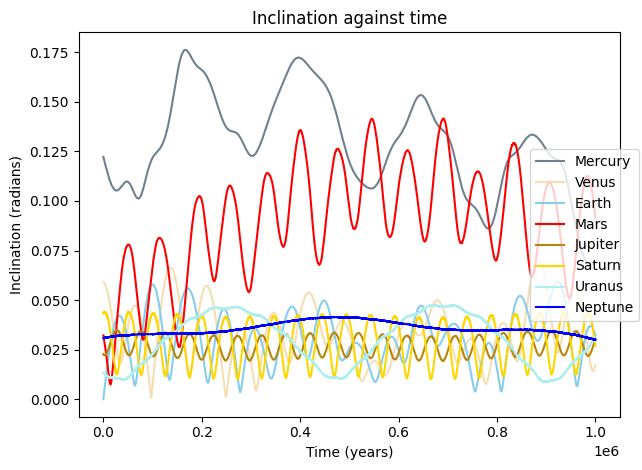
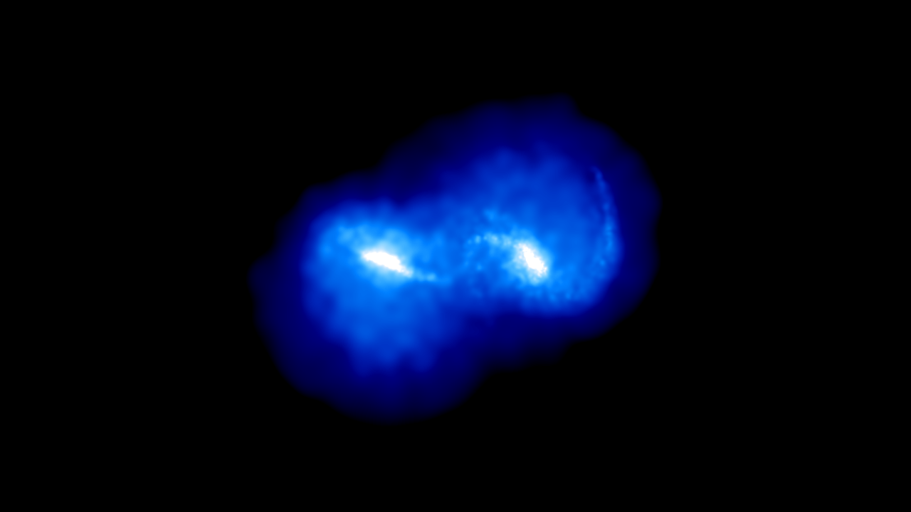

# Gravity Simulator
Newtonian N-body gravity simulator accelerated with C library

This is a student project developed for learning purpose.
It aims to provide a toolbox for simple Newtonian gravity simulations and visualizations.

Features:
* Ten integrators including WHFast and IAS15
* Barnes-Hut algorithm
* Interfaces: CLI and API
* CUDA implementation for the pairwise acceleration function
* Multiple sample projects

## Sample projects

Some projects are done with the API. The scripts are stored at the `examples` folder.

#### Simulating the solar system for 1 million years

#### Asteroid belt animation

#### Formation of Kirkwood gap

Videos:
* https://www.youtube.com/watch?v=AEyjIF-8zT0
* https://www.youtube.com/watch?v=jHLLr7ACvDQ

#### Galaxy collision
Note: This simulation is for demonstration only. The initial conditions are very different from actual galaxies.

Videos:
* https://www.youtube.com/watch?v=g45o0Vf4zDk
* https://www.youtube.com/watch?v=OdfgFYLYcVw

## Documentation
The documentations for CLI and API are available in the `docs` folder.

## Feedback and Bugs
If you found any bugs or want to leave some feedback, please feel free to let me know by opening an issue or sending an email to alvinng324@gmail.com.

## Acknowledgement
The following book helped me a lot in learning the basics of N-body simulations and also
the implementation of the integrators.
* J. Roa, et al. *Moving Planets Around: An Introduction to N-Body Simulations Applied to Exoplanetary Systems*, MIT Press, 2020